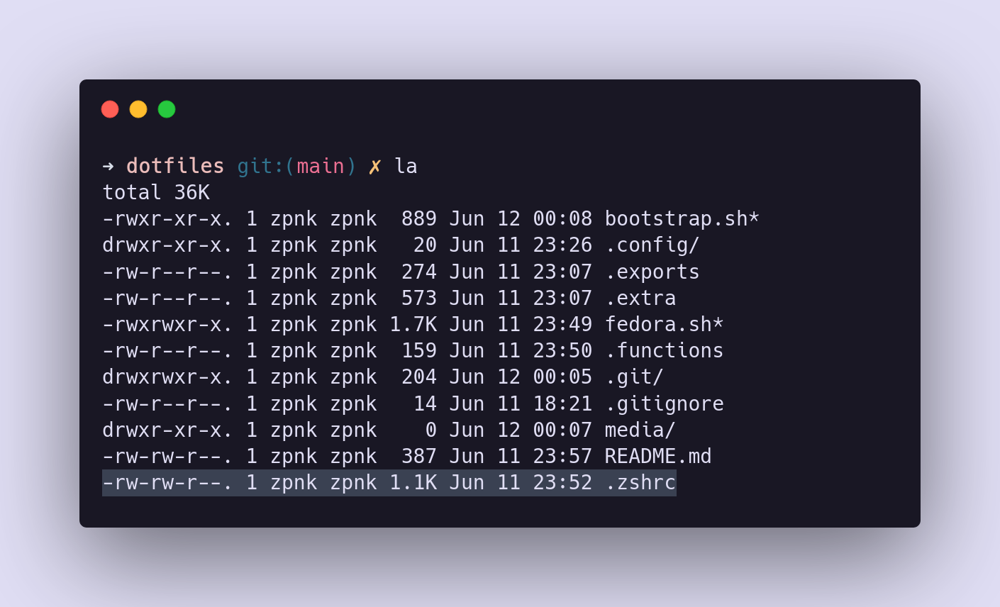

# ~/.dotfiles

The structure of this dotfiles repository mimics the structure of the `$HOME` directory.

Configuration files must be placed in the `.config` directory and should be named accordingly to the software they belong to.

## Credits

- [mathiasbynens/dotfiles](https://github.com/mathiasbynens/dotfiles)
- [sobolevn/dotfiles](https://github.com/sobolevn/dotfiles)